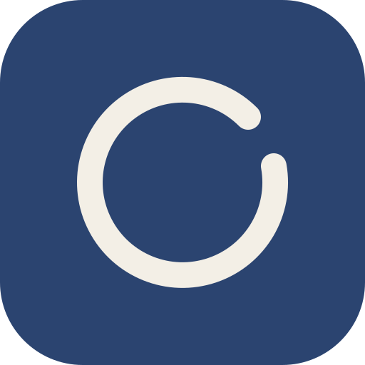
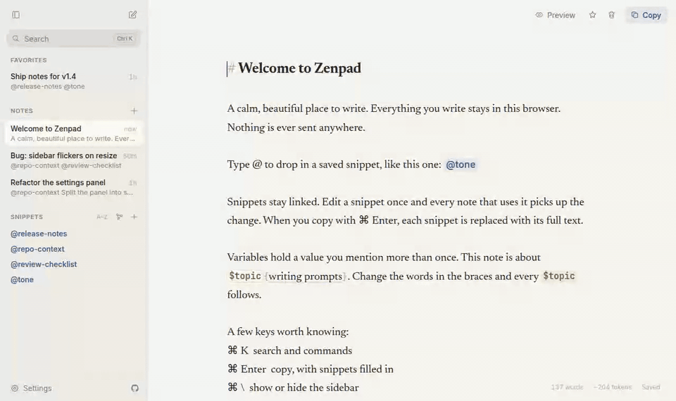

<p align="center">
  
</p>

<h1 align="center">Zenpad</h1>

<p align="center">
  A calm, beautiful place to write, with reusable <code>@snippets</code>.<br>
  Private, offline, and entirely in your browser.
</p>

<p align="center">
  <a href="https://zenpad.pages.dev"><strong>Open Zenpad →</strong></a>
</p>

<p align="center">
  
</p>

Zenpad was built for writing AI prompts, but it works for any writing where you repeat yourself. Save the text you reuse as a snippet, type `@` to drop it into any note, and copy the note with everything filled in.

## Features

- **Focused writing.** One centered page in a warm serif. The chrome fades away while you type.
- **@snippets.** Snippets stay linked, so editing one updates every note that uses it. They can nest, and loops are caught.
- **$variables.** Set `$branch = fix/login` once, or inline as `$branch{fix/login}`, and use `$branch` anywhere in the note. Snippets can use them too.
- **Folded blocks.** Keep long context in a note without it taking over the page: put it between `$context = """` and `"""`, and it folds into a one-line chip. Use `$context` where it belongs in the prompt. Or paste the text, select it, and click **Fold away** to do all of that in one step.
- **Checklists.** Write `- [ ]` or press `⌘ ⇧ L` to turn lines into a checklist, then click a circle to check it off. The status bar shows how far along the note is, and in the sidebar a small pie fills in beside the count of done tasks, turning into a check mark once every one is done.
- **Preview and copy.** See the note exactly as it will be copied, with every snippet and variable filled in.
- **Snippet map.** An interactive graph of your snippets and the notes that use them.
- **Grouped by date.** The sidebar lists notes under Today, Yesterday, Previous 7 days, Previous 30 days, then by month and year. Click a heading to collapse it. Switch to one list with the button beside Notes, or in Settings.
- **Search and commands.** `⌘ K` finds any note or snippet and runs any command. Results are ranked by best match across all three, with title hits first, then initials (`tfm` finds "Toggle focus mode"), then matches in the text.
- **Private by design.** No server, no accounts, no analytics, and a strict Content Security Policy that blocks network requests.
- **Works offline.** Install it as an app (PWA). Light and dark themes, plus serif, sans, and mono fonts.

## Keyboard

| Keys | Action |
| --- | --- |
| `⌘ K` | Search and commands |
| `⌘ Enter` | Copy with snippets filled in |
| `⌘ E` | Preview with snippets filled in, or back to editing |
| `⌘ ⇧ L` | Turn the selected lines into a checklist, or back |
| `⌘ ⇧ Enter` | Check off the task the cursor is on |
| `⌘ \` | Show or hide the sidebar |
| `⌘ ⌥ N` | New note |
| `⌘ click` an `@snippet` | Open it, or create it if it doesn't exist |
| `⌘ click` a `$variable` | Jump to its value, ready to change |
| `⌘ F` | Find in the current note |

On Windows and Linux, use `Ctrl` in place of `⌘`.

## Snippets and variables

- **Snippet names** use lowercase letters, numbers, `-`, and `_`, like `@repo-context`. An `@` right after a letter or number is ignored, so `me@site.com` is left alone. Renaming a snippet updates every reference to it.
- **Variable names** start with a letter and use letters, numbers, `-`, and `_`. Case matters, so `$PR` and `$pr` are different. Only names the note sets are filled in, so `$HOME` or `$5` stay as written.
- `$name = value` lines are left out when you copy or preview. Inline `$name{value}` copies as just the value.
- For a value that spans several lines, start with `$name = """` on a line of its own and end with a line of just `"""`. Click the chip to show the text and **Fold** to hide it again; each note remembers which blocks you left open, and the rest start folded. Like other definitions, a block is left out when you copy, and `$name` fills in the whole text. A block without its closing `"""` is not a block yet.
- **Fold away** (next to Make a snippet, above selected text in a note) moves the selection into a folded `$context` block just above it and leaves `$context` in its place, so the note copies exactly as before. Both copies of the name are selected afterwards: type to rename them, or press `Esc` to keep `$context`.
- A snippet's `$pr` is filled in from the note it is copied from, so one `@review-pr` snippet works for every PR.

## Checklists

- Checklists are plain Markdown task lists: `- [ ] to do` and `- [x] done`, with `*`, `+`, or a number in place of `-`. They copy exactly as written.
- `Enter` carries a checklist on to the next line, and `Enter` on an empty task ends it. `Backspace` at the start of a task removes its box.
- Progress counts every task in the note, nested ones included. Tasks inside fenced code blocks are left out.

## Your data

Notes and snippets live in this browser's IndexedDB and never leave it. Clearing site data can delete them, so **export a backup** from Settings now and then. Importing a backup merges it, and the newer copy of each note or snippet wins.

## Development

Requires Node 20.19 or newer.

```bash
npm install
npm run dev        # start the dev server
npm test           # unit tests
npm run build      # production build in dist/
npm run test:e2e   # browser smoke tests (after npm run build)
```

To fill a local library with test data, run **Add sample data** from the command palette (`⌘ K`) in `npm run dev`. It adds about 20 notes and 14 snippets, including nested snippets, variables, a snippet loop, and a missing reference. `npm run build:sample` makes a build that seeds the same data on first launch; pull request previews use it. The command is left out of production builds.

Built with Vite, React, TypeScript, CodeMirror 6, and Dexie, and deployed to Cloudflare Pages from `main`. See [AGENTS.md](AGENTS.md) for the project layout, conventions, and CI.

## License

[MIT](LICENSE)
